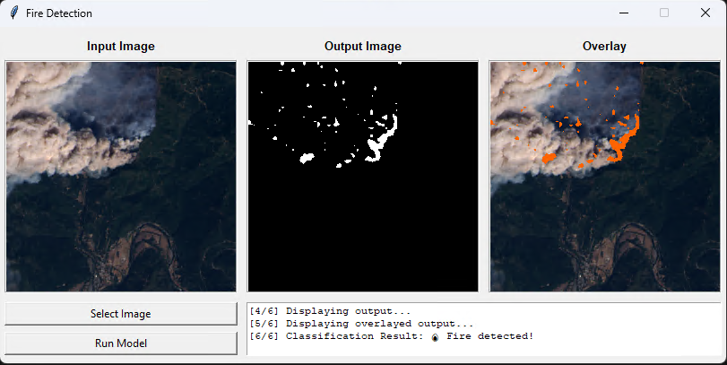

# 🔥 SegFire

**Fire Detection from Satellite Imagery using Vision Transformers**

SegFire is a deep learning-based tool for segmenting fire-affected areas in satellite images. It uses the powerful SegFormer architecture (a Vision Transformer variant) for accurate and efficient fire detection. This project also includes a simple graphical user interface (GUI) for user-friendly interaction.

---

## 📸 Demo

### 🔍 Model Output


### 🖥️ GUI Interface



---

## 🚀 Features

* ✅ Fire segmentation from satellite images using Vision Transformers (SegFormer)
* ✅ High accuracy and fast inference
* ✅ Easy-to-use GUI for testing new images
* ✅ Modular and clean codebase

---

## 📂 Project Structure

```
SegFire/
├── data/
├── model/SegFormer/   
├── output/             
├── src/                
    ├── app.py   
    ├── utils.py 
    ├── data_processing.ipynb
    ├── SegFormer_Tuning.ipynb  
├── LICENSE  
└── README.md
```

---

## ⚙️ Setup

1. **Clone the repo** :

```bash
git clone https://github.com/atallahmadi/SegFire.git
cd SegFire
```

2. **Prepare your data** :

Place your satellite images into the `data/` folder. Ensure you have corresponding labels for training and validation.

---

## 🧠 Training the Model

To train the SegFormer model on your dataset:

```bash
src/SegFormer_Tuning.ipynb
```

## 🖼️ Run the GUI

Use the GUI to load and test images interactively:

```bash
python app.py
```

---

## 📦 Requirements

* Python 3.8+
* PyTorch
* OpenCV
* NumPy
* matplotlib
* tkinter

---

## 📄 License

This project is licensed under the MIT License. See [LICENSE](LICENSE) for more info.

---

## 🙌 Acknowledgments

Thanks to the creators of SegFormer and the open-source satellite imagery datasets used in training and testing.
